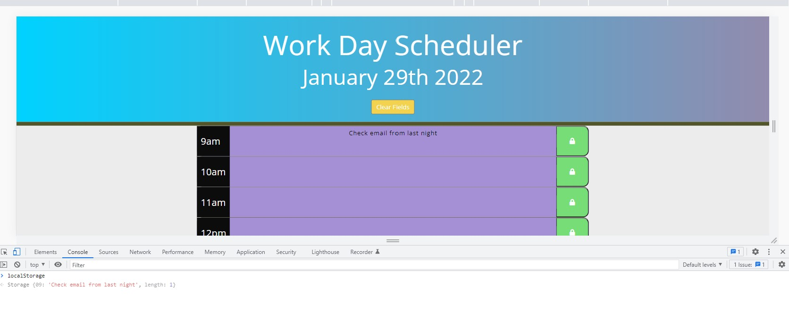

# daily-planner https://blerandism.github.io/daily-planner/

- The daily planner website helps the user to organize their day
- Right on top they are presented with the current date of the use 
- The day is divided in task boxed from 9 am to 5 pm representing a full day of work
- User has the chance to enter the data and save it in the local storage for future use

- The Clear Field button deletes all the information from the page
- After the time for each specific time is passed the box turns purple and the future coming "to-dos" are in green

# Contributors 
- **Blerand Ismaili** https://github.com/BlerandIsm/daily-planner

